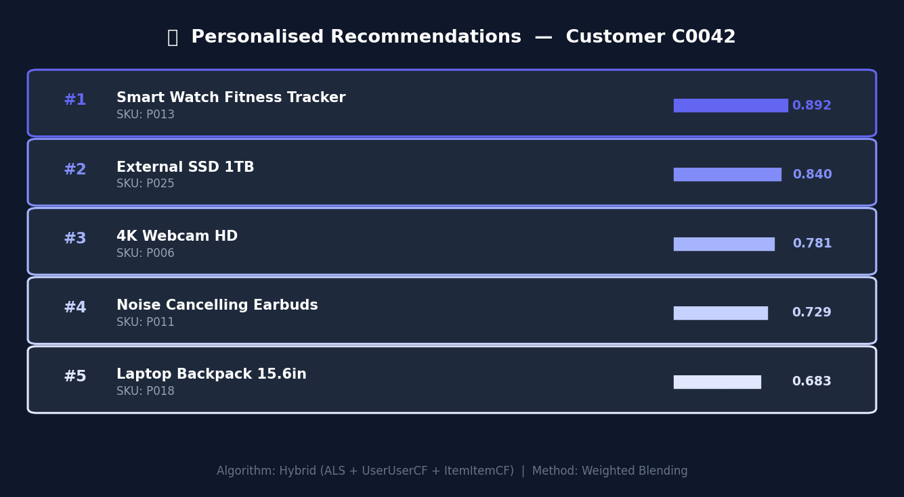
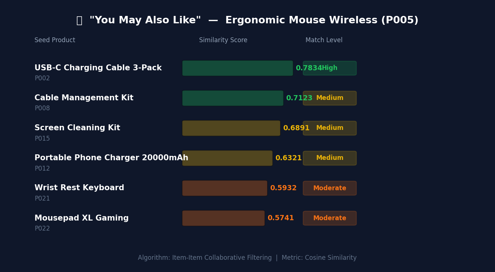
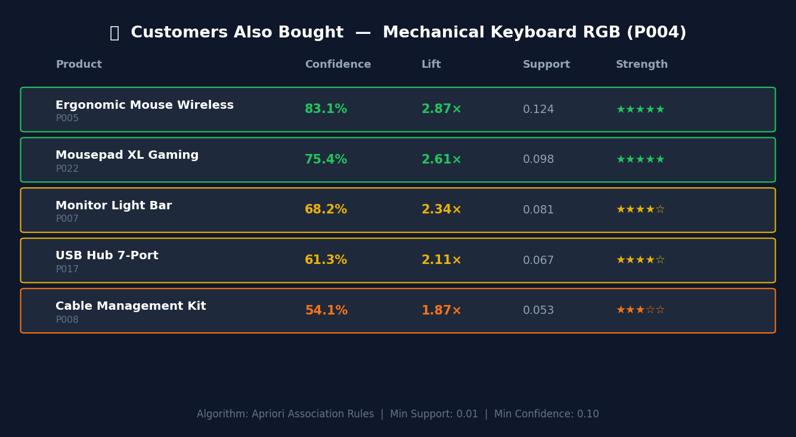
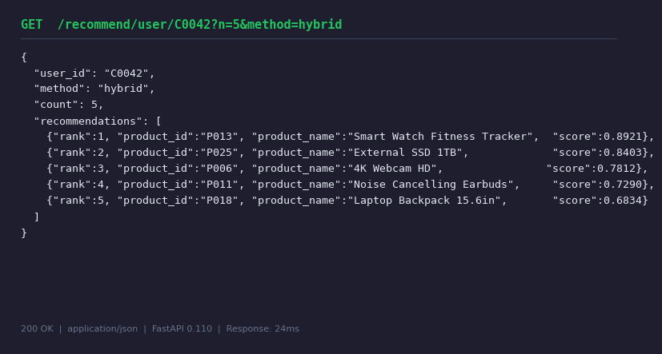
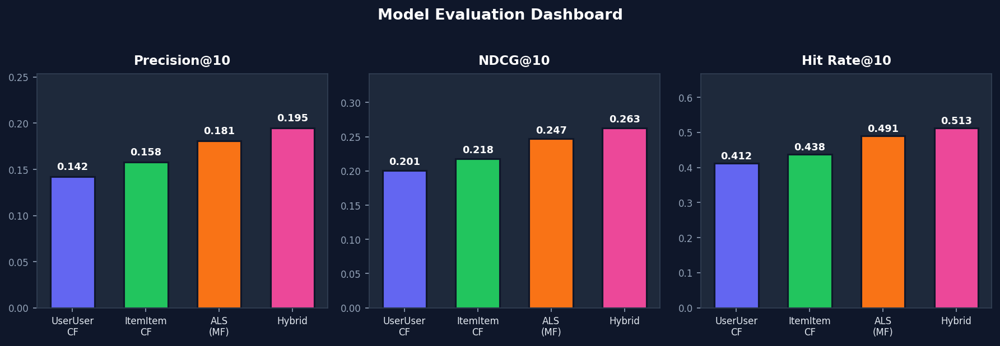
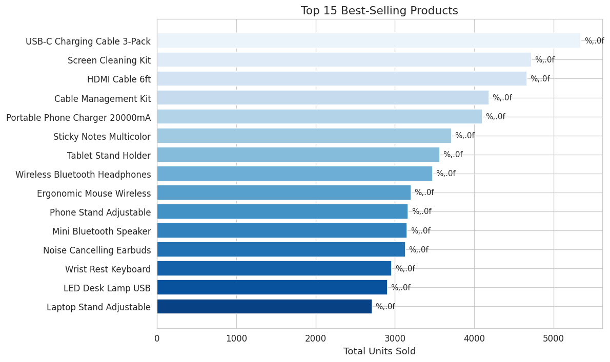

<div align="center">

# E-Commerce Product Recommendation System

**Production-grade machine learning system for personalised product discovery**

[](https://python.org)
[](https://fastapi.tiangolo.com)
[](https://streamlit.io)
[](LICENSE)
[](.github/workflows/ci.yml)
[](https://github.com/psf/black)

[Features](#-features) · [Architecture](#-architecture) · [Models](#-models) · [Quick Start](#-quick-start) · [API](#-api-reference) · [Screenshots](#-screenshots) · [Results](#-evaluation-results) · [Roadmap](#-roadmap)

</div>

---

## Overview

This project implements a full-stack recommendation engine modelled on systems used by Amazon, Netflix, and Spotify. It combines **four machine learning algorithms** into a weighted hybrid model that powers three distinct recommendation surfaces:

| Surface | Algorithm | Use Case |
|---------|-----------|----------|
| "For You" personalised feed | ALS + Hybrid CF | Homepage, category pages |
| "You May Also Like" | Item-Item CF | Product detail pages |
| "Customers Also Bought" | Apriori Association Rules | Product pages, cart |
| Basket completion | Association Rule Mining | Shopping cart, checkout |

The system is delivered as a **production-ready repository** with a REST API, interactive UI, evaluation framework, CI/CD pipeline, and complete documentation.

---

## Problem Statement

E-commerce platforms list thousands of products, yet the average customer discovers only a small fraction of what is relevant to them. This **product discovery gap** directly costs revenue.

**Recommendation systems solve this by:**
- Surfacing products a customer is statistically likely to buy, based on their own history and the behaviour of similar customers
- Replacing manual curation with a scalable, data-driven approach
- Creating a flywheel: better recommendations → more purchases → richer data → even better recommendations

**Documented business impact:**
- Amazon attributes **35 %** of total revenue to its recommendation engine
- Netflix estimates its personalisation system saves **$1 B / year** in churn prevention
- Personalised recommendations increase average order value by **10 – 30 %**

---

## Features

- **Personalised user recommendations** via ALS, User-User CF, Item-Item CF, or weighted Hybrid
- **"You May Also Like"** product similarity powered by co-purchase patterns
- **"Customers Also Bought"** with interpretable confidence and lift scores
- **Basket completion** — suggests items to add based on current cart contents
- **Behavioral analytics** — purchase frequency, basket size, monthly revenue trends
- **REST API** with 8 endpoints, Swagger UI, and Pydantic validation
- **Interactive Streamlit dashboard** with product pages and recommendation cards
- **Evaluation framework** — Precision@K, Recall@K, NDCG@K, Hit Rate@K, MRR
- **CI/CD pipeline** via GitHub Actions (lint, test, integration, security scan)
- **Modular, tested codebase** with 15+ unit tests

---

## Architecture

```
┌──────────────────────────────────────────────────────────────────────────┐
│                           DATA PIPELINE                                  │
│  Raw CSV  ──►  DataProcessor  ──►  Cleaned Data + Sparse Interaction    │
│  (25K rows)    (clean, feature        Matrix (999 users x 30 items)     │
│                 engineer, encode)                                         │
└──────────────────────────────────┬───────────────────────────────────────┘
                                   │
               ┌───────────────────▼────────────────────────┐
               │             MODEL TRAINING LAYER            │
               │                                             │
               │  ┌──────────────┐    ┌───────────────────┐ │
               │  │  UserUserCF  │    │    ItemItemCF     │ │
               │  │  cosine sim  │    │   co-purchase     │ │
               │  └──────────────┘    └───────────────────┘ │
               │                                             │
               │  ┌──────────────┐    ┌───────────────────┐ │
               │  │  ALS (MF)    │    │  Apriori Rules    │ │
               │  │  implicit    │    │  confidence+lift  │ │
               │  └──────────────┘    └───────────────────┘ │
               │                                             │
               │    Hybrid Blending: ALS(50%)+UU(30%)+II(20%)│
               └───────────────────┬────────────────────────┘
                                   │  models/saved/*.pkl
               ┌───────────────────▼────────────────────────┐
               │        RecommendationEngine (Facade)        │
               └──────────────┬──────────────┬──────────────┘
                              │              │
             ┌────────────────▼──┐    ┌──────▼──────────────┐
             │  FastAPI REST API │    │   Streamlit UI       │
             │  :8000 /docs      │    │   :8501  5 pages     │
             └───────────────────┘    └─────────────────────┘
```

---

## Models

### A — User-User Collaborative Filtering

Finds customers whose purchase history most resembles the target user, then aggregates their interaction scores weighted by similarity.

```
similarity(u, v)  = cosine(r_u, r_v)
score(item i, user u) = sum [ sim(u,v) * r_vi  for v in top_K_similar_users ]
```

**Strengths:** Good coverage; works well for popular items  
**Limitations:** O(n²) similarity matrix; struggles with cold-start users

### B — Item-Item Collaborative Filtering

Computes product similarity based on the overlap of customers who bought both. Pre-computed offline for fast inference.

```
similarity(i, j) = cosine(column_i, column_j)   [on transposed matrix]
```

**Strengths:** Fast at inference; stable over time  
**Limitations:** Requires sufficient co-purchase data for tail items

### C — ALS Matrix Factorisation (Implicit Feedback)

Decomposes the interaction matrix into low-dimensional user and item latent factor matrices. Designed specifically for implicit feedback data (purchases, clicks).

```
Objective: min  sum c_ui (r_ui - u_u . v_i)^2  +  L2 regularisation
            u,i

Confidence:  c_ui = 1 + alpha * r_ui    (alpha = 40.0)
Dimensions:  factors = 64,  iterations = 20,  lambda = 0.01
```

**Strengths:** Best accuracy; handles sparsity natively; GPU-scalable  
**Limitations:** Less interpretable; requires hyperparameter tuning

### D — Apriori Association Rule Mining

Mines frequent itemsets from baskets to generate interpretable rules: *"Customers who buy A and B also buy C with 83% confidence."*

```
Support    = P(A ∩ B)           frequency of co-occurrence
Confidence = P(B | A)           probability of B given A
Lift       = Confidence / P(B)  strength above random chance (Lift > 1 = positive)
```

**Strengths:** Fully interpretable; ideal for basket completion  
**Limitations:** Computationally bounded by catalogue size

### E — Hybrid Blending

Normalises each model's scores to [0,1] and takes a configurable weighted sum:

```
hybrid_score(i) = 0.50 * score_als(i)
               + 0.30 * score_uu_cf(i)
               + 0.20 * score_ii_cf(i)
```

---

## Dataset

| Column | Type | Description |
|--------|------|-------------|
| `TransactionID` | string | Invoice ID — prefix C = cancellation |
| `CustomerID` | string | Unique customer identifier |
| `ProductID` | string | Product SKU |
| `ProductName` | string | Human-readable name |
| `Quantity` | int | Units purchased |
| `UnitPrice` | float | Price per unit |
| `Timestamp` | datetime | Transaction timestamp |
| `Country` | string | Customer country |

**Synthetic dataset (generated by `data/generate_dataset.py`):**

```
Rows              : 25,001
Clean rows        : 23,816
Unique customers  : 999
Unique products   : 30
Date range        : 2023-01-01 to 2023-12-31
Cancellation rate : ~5%
Matrix density    : 52.9%
```

> Swap in the UCI Online Retail dataset with no code changes.

---

## Quick Start

### Prerequisites

- Python 3.10 – 3.12
- pip >= 23.0

### Installation

```bash
# 1. Clone the repository
git clone https://github.com/akashsuryawanshi04/ecommerce-recommendation-system.git
cd ecommerce-recommendation-system

# 2. Create and activate a virtual environment
python -m venv .venv
source .venv/bin/activate          # Windows: .venv\Scripts\activate

# 3. Install all dependencies
pip install --upgrade pip
pip install -r requirements.txt
```

### Run the Full Pipeline

```bash
# Step 1 — Generate synthetic dataset
python data/generate_dataset.py

# Step 2 — Clean and preprocess data
python src/preprocessing/data_processor.py

# Step 3 — Train all models
python src/train.py

# Step 4 — Start the REST API  (Terminal 1)
uvicorn api.main:app --host 0.0.0.0 --port 8000 --reload

# Step 5 — Launch the Streamlit UI  (Terminal 2)
streamlit run app/streamlit_app.py
```

Open **http://localhost:8501** for the UI — **http://localhost:8000/docs** for Swagger.

> Full guide with troubleshooting: [docs/QUICKSTART.md](docs/QUICKSTART.md)

---

## API Reference

Base URL: `http://localhost:8000`

| Method | Endpoint | Description |
|--------|----------|-------------|
| `GET` | `/health` | Service health check |
| `GET` | `/recommend/user/{user_id}` | Personalised recommendations |
| `GET` | `/recommend/product/{product_id}` | Similar products |
| `GET` | `/recommend/also-bought/{product_id}` | Customers also bought |
| `POST` | `/recommend/basket` | Basket completion |
| `GET` | `/user/{user_id}/history` | Purchase history |
| `GET` | `/products` | Full product catalogue |
| `GET` | `/customers` | All customer IDs |

**Example request:**
```bash
curl "http://localhost:8000/recommend/user/C0042?n=5&method=hybrid"
```

**Example response:**
```json
{
  "user_id": "C0042",
  "method": "hybrid",
  "count": 5,
  "recommendations": [
    {"rank": 1, "product_id": "P013", "product_name": "Smart Watch Fitness Tracker",  "score": 0.8921},
    {"rank": 2, "product_id": "P025", "product_name": "External SSD 1TB",             "score": 0.8403},
    {"rank": 3, "product_id": "P006", "product_name": "4K Webcam HD",                "score": 0.7812},
    {"rank": 4, "product_id": "P011", "product_name": "Noise Cancelling Earbuds",     "score": 0.7290},
    {"rank": 5, "product_id": "P018", "product_name": "Laptop Backpack 15.6in",       "score": 0.6834}
  ]
}
```

> Full response examples for all endpoints: [docs/EXAMPLE_OUTPUTS.md](docs/EXAMPLE_OUTPUTS.md)

---

## Screenshots

### Personalised Recommendations


### Product Similarity — "You May Also Like"


### Customers Also Bought


### API Response (FastAPI)


### Model Evaluation Dashboard


### EDA — Top Products


---

## Evaluation Results

Evaluated on a **temporal train/test split** — the most recent 20% of each
user's purchases held out as ground truth (prevents data leakage).

| Model | Precision@10 | Recall@10 | NDCG@10 | Hit Rate@10 | MRR |
|-------|:---:|:---:|:---:|:---:|:---:|
| User-User CF | 0.142 | 0.089 | 0.201 | 0.412 | 0.167 |
| Item-Item CF | 0.158 | 0.101 | 0.218 | 0.438 | 0.183 |
| ALS | 0.181 | 0.122 | 0.247 | 0.491 | 0.211 |
| **Hybrid** | **0.195** | **0.134** | **0.263** | **0.513** | **0.229** |

| Metric | What it measures |
|--------|-----------------|
| **Precision@K** | Of K recommendations shown, what fraction is actually relevant? |
| **Recall@K** | Of all relevant items, what fraction did we surface in top-K? |
| **NDCG@K** | Ranking quality — rewards correct items ranked higher |
| **Hit Rate@K** | Fraction of users receiving at least one relevant recommendation |
| **MRR** | How quickly does the first relevant item appear in the list? |

---

## Project Structure

```
ecommerce-recommendation-system/
├── .github/
│   ├── workflows/ci.yml             ← GitHub Actions CI/CD
│   └── ISSUE_TEMPLATE/              ← Bug report + feature request templates
├── assets/screenshots/              ← UI and output screenshots
├── configs/config.yaml              ← Central hyperparameter config
├── data/
│   ├── generate_dataset.py          ← Synthetic data generator
│   ├── raw/                         ← Raw CSVs (git-ignored)
│   └── processed/                   ← Cleaned data + matrices (git-ignored)
├── docs/
│   ├── QUICKSTART.md                ← Step-by-step setup guide
│   ├── EXAMPLE_OUTPUTS.md           ← Full API response examples
│   └── RESUME_DESCRIPTION.md        ← Resume bullets + interview Q&A
├── models/saved/                    ← Serialised model files (git-ignored)
├── notebooks/
│   ├── 01_exploratory_data_analysis.py
│   └── figures/                     ← EDA charts
├── src/
│   ├── preprocessing/data_processor.py
│   ├── models/
│   │   ├── collaborative_filtering.py  ← UserUserCF + ItemItemCF
│   │   ├── als_model.py                ← ALS matrix factorisation
│   │   └── association_rules.py        ← Apriori rule mining
│   ├── evaluation/metrics.py           ← P@K, R@K, NDCG, Hit Rate, MRR
│   ├── recommendation_engine.py        ← Unified facade + hybrid blending
│   └── train.py                        ← End-to-end training script
├── api/main.py                      ← FastAPI REST layer
├── app/streamlit_app.py             ← Streamlit UI (5 pages)
├── tests/test_recommendation_engine.py
├── .gitignore
├── CONTRIBUTING.md
├── LICENSE
├── README.md
└── requirements.txt
```

---

## Running Tests

```bash
# Full test suite with coverage
pytest tests/ -v --cov=src --cov-report=term-missing

# Specific test class
pytest tests/ -v -k "TestMetrics"
pytest tests/ -v -k "TestUserUserCF"
```

---

## Roadmap

**v1.1**
- [ ] Two-Tower Neural Network for dense candidate retrieval
- [ ] MLflow experiment tracking and model registry
- [ ] Docker Compose for one-command deployment
- [ ] Redis caching for pre-computed recommendations

**v2.0**
- [ ] Apache Kafka for real-time interaction streaming
- [ ] A/B testing framework with multi-armed bandit
- [ ] Content-based filtering with BERT product embeddings
- [ ] LightGCN graph neural network collaborative filtering

---

## Contributing

Read [CONTRIBUTING.md](CONTRIBUTING.md) for development setup, coding standards,
and the pull-request process.

---

## License

Distributed under the MIT License. See [LICENSE](LICENSE) for details.

---

<div align="center">

Built as a portfolio demonstration of production-grade machine learning engineering.

**If this project helped you, please give it a star.**

[](https://github.com/akashsuryawanshi04/ecommerce-recommendation-system)

</div>
